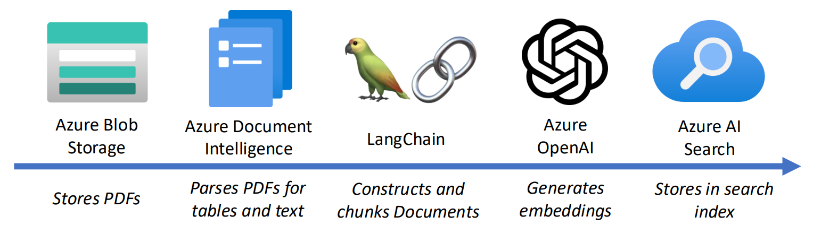

# Multi-structured Financial Report Question-Answering
Extract text, tables, and figures from (financial report) PDFs and upload them into an (Azure AI Search) index for (financial data) question-answering (QA) with a large language model (LLM) in a Retrieval-Augmented Generation (RAG) framework.

## Features
* Extraction of text, tables, and figures from PDFs stored in an Azure Blob Storage container using Azure Document Intelligence
* Conversion of chart figures to underlying tabular form using a chart-to-table model
* Document object creation and chunking using ```LangChain``` functionality
* Document embedding generation using Azure OpenAI and insertion into an Azure AI Search index
<!-- ```python
{page_num: {'text': [extracted_text], 'tables': [extracted_tables]}
``` -->



## Services Used
* Azure Blob Storage
* Azure Document Intelligence
* Azure OpenAI
* Azure AI Search

## Usage
First, clone and navigate to the repository:
```bash
git clone https://github.com/manulife-ai/FinancialQA
cd FinancialQA/
```
Then, install the package locally using ```pip```:
```bash
pip install -e .
```

Set the required environment variables shown below in a file named `.env` (in the ```FinancialQA/``` directory), so that it can be discovered and loaded by the `dotenv` package at runtime. The targeted PDF files must be hosted in an Azure Blob Storage container, as specified by the ```AZURE_STORAGE_*``` variables. The ```AZURE_AI_SEARCH_INDEX_NAME``` variable can be set to an index with the appropriate schema if it exists.

```bash
AZURE_STORAGE_CONTAINER_NAME=""
AZURE_STORAGE_CONTAINER_ACCOUNT=""
AZURE_STORAGE_CONNECTION_STRING=""

AZURE_DOCINTEL_KEY=""
AZURE_DOCINTEL_VERSION=""
AZURE_DOCINTEL_ENDPOINT=""

AZURE_AI_SEARCH_KEY=""
AZURE_AI_SEARCH_INDEX_NAME=""
AZURE_AI_SEARCH_SERVICE_NAME=""

AZURE_OPENAI_KEY=""
AZURE_OPENAI_TYPE=""
AZURE_OPENAI_VERSION=""
AZURE_OPENAI_ENDPOINT=""
```

Please keep in mind the following points:
- If you wish to load PDF files from local disk instead of reading them from Blob storage, please store them in a ```data/``` folder under the ```src/``` directory.
- For financial report PDFs, please use the following file naming convention: ```<company_name>_<company_quarter>``` e.g., ```CIBC_Q4```, so that the correct company name and report quarter are extracted and can be used for filtering the index when invoking the RAG pipeline.

The ```financialqa``` package can then be imported and used in a script:
```python
# Extract multi-structured content from PDFs, create, chunk, and generate embeddings of Document objects of extracted PDF contents, and insert Documents into an Azure AI Search index
from financialqa.ingestion.ingestionpipeline import IngestionPipeline

ingestion_pipeline = IngestionPipeline()
ingestion_pipeline.ingest_pdfs(
    extract_pdfs_from_blob=True,
    convert_chart_to_table=True,
    chart_to_table_model="deplot",
    chart_to_table_model_path="",
    upload_docs_in_batches=True,
    batch_size=50,
    overwrite_index=True,
) 

# Perform inference based on the indexed Documents
from financialqa.inference.inferencepipeline import InferencePipeline

inference_pipeline = InferencePipeline()
inference_pipeline.invoke_rag_pipeline(
    query='What is the 5-yr Average P/E?', 
    company_name='CIBC',
    top_k=3,
)
```

Or run as a script directly from the command line (type ```--help``` after the command to see the full list of options):

```bash
$ python3 -m financialqa.ingestion.ingestionpipeline --convert_chart_to_table
$ python3 -m financialqa.inference.inferencepipeline --query 'What is the 5-yr Average P/E?'
```
