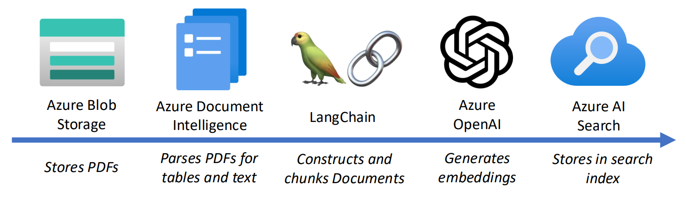

# Multi-structured Financial Report Question-Answering
Extract text, tables, and figures from (financial report) PDFs and upload them into an (Azure AI Search) index for (financial data) question-answering (QA) with a large language model (LLM) in a Retrieval-Augmented Generation (RAG) framework.

## Reference
This repository is based on the methods and findings from the following paper which was accepted to the European Conference on Information Retrieval (ECIR) 2026 Industry Track: [**On the Comprehensibility of Multi-structured Financial Documents using LLMs and Pre-processing Tools**](https://arxiv.org/abs/2506.05182). For a detailed overview of the project, please refer to the paper.

## Features
* Extraction of text, tables, and figures from PDFs using Azure Document Intelligence.
* Conversion of chart figures into linearized tabular data using a chart‑to‑table model (e.g., DePlot).
* Creation of document objects with metadata and chunking using ```LangChain``` utilities.
* Generation of document embeddings using Azure OpenAI and batch insertion into an Azure AI Search index.
* Retrieval and filtering of relevant multi-structured documents from the index to provide context to an LLM for QA (i.e., RAG).
<!-- ```python
{page_num: {'text': [extracted_text], 'tables': [extracted_tables]}
``` -->



<div align="center"><em>Figure 1: An overview of the ingestion pipeline.</em></div>

## Services Used
* Azure Blob Storage
* Azure Document Intelligence
* Azure OpenAI
* Azure AI Search

## Pipelines Overview

**Ingestion Pipeline** (`src/financialqa/ingestion/`):
- Handles extraction, parsing, and preprocessing of multi-structured data from PDFs and other sources.
- Modular helpers and parsers for extensibility (see `ingestionpipeline.py`, `parser.py`, `helper.py`).

**Inference Pipeline** (`src/financialqa/inference/`):
- Provides a streamlined interface for running RAG-based inference on indexed documents.
- Easily integrates with different models and supports flexible query options (see `inferencepipeline.py`).

See the respective modules for more details and usage examples.

## Usage
First, clone and navigate to the repository:
```bash
git clone https://github.com/manulife-ai/FinancialQA
cd FinancialQA/
```
Then, create a new virtual environment and install the package locally using ```pip```:
```bash
pip install .
```

Set the required environment variables shown below in a file named `.env` in the ```FinancialQA/``` directory (see `.env.example` for a reference template), so that it can be discovered and loaded by the `dotenv` package at runtime. PDF files can be stored either in an Azure Blob Storage container (as configured by the ```AZURE_STORAGE_*``` variables) or locally in a `data/` folder under the `src/` directory. For quarterly financial report PDFs, use the naming convention `<company_name>_<company_quarter>` (e.g., `CIBC_Q4`) to ensure correct metadata extraction during ingestion and to enable filtering of the search index during inference. The ```AZURE_AI_SEARCH_INDEX_NAME``` variable can be set to the name of an existing index with the required schema, otherwise a new index with the specified name is created.

```bash
AZURE_STORAGE_CONTAINER_NAME=
AZURE_STORAGE_CONTAINER_ACCOUNT=
AZURE_STORAGE_CONNECTION_STRING=

AZURE_DOCINTEL_KEY=
AZURE_DOCINTEL_VERSION=
AZURE_DOCINTEL_ENDPOINT=

AZURE_AI_SEARCH_KEY=
AZURE_AI_SEARCH_INDEX_NAME=
AZURE_AI_SEARCH_SERVICE_NAME=

AZURE_OPENAI_KEY=
AZURE_OPENAI_VERSION=
AZURE_OPENAI_ENDPOINT=
AZURE_OPENAI_EMBEDDING_MODEL=
AZURE_OPENAI_COMPLETION_MODEL=
```

**Notes:**
- For chart-to-table translation using [ChartVLM](https://huggingface.co/U4R/ChartVLM-base), install its 'model_base_decoder' module in the `src/models/` directory, otherwise [DePlot](https://huggingface.co/google/deplot) will be used by default.
- PDF files can be stored locally under `src/data/` or in a Azure Blob Storage container based on the configured environment variables.
- For quarterly financial report PDFs, use the naming convention `<company_name>_<company_quarter>` (e.g., `CIBC_Q4`) to ensure correct metadata extraction and filtering in the RAG pipeline.

The ```financialqa``` package can then be imported and used in a script (see `notebooks/ingest_and_generate.ipynb` for an end-to-end example):
```python
# Extract and process multi-structured content from PDFs and upload them to an index
from financialqa.ingestion.ingestionpipeline import IngestionPipeline

ingestion_pipeline = IngestionPipeline()
ingestion_pipeline.ingest_pdfs(
    extract_pdfs_from_blob=True,
    convert_chart_to_table=True,
    chart_to_table_model="deplot",
    chart_to_table_model_path="",
    upload_docs_in_batches=True,
    batch_size=50,
    overwrite_index=True,
) 

# Query the index to retrieve relevant context for LLM-based QA (i.e., RAG)
from financialqa.inference.inferencepipeline import InferencePipeline

inference_pipeline = InferencePipeline()
inference_pipeline.invoke_rag_pipeline(
    query='What is the 5-yr Average P/E?', 
    company_name='CIBC',
    top_k=3,
)
```

Or run as a module directly from the command line (type ```--help``` after the command to see the full list of options):

```bash
$ python3 -m financialqa.ingestion.ingestionpipeline --convert_chart_to_table
$ python3 -m financialqa.inference.inferencepipeline --query 'What is the 5-yr Average P/E?'
```
